# 【AI人工智能】哔哩哔哩大学优质资源整合推荐-B站学习白嫖指南

众所周知，bilibili是一个学习网站，上面有海量的优质学习资源。

但问题就是过于海量，让人一时间不知道从何嫖起。

这份指南，基本涵盖了日常工作和面试中需要用到的大部分知识点，以及对应b站的优质资源链接。

## B站UP

| UP id              | logo                                                    | 描述                                                                                                                                                                                                                                                                                                        | 粉丝  | 主页链接                                                                         |
|--------------------|---------------------------------------------------------|-------------------------------------------------------------------------------------------------------------------------------------------------------------------------------------------------------------------------------------------------------------------------------------------------------------|-------|----------------------------------------------------------------------------------|
| 3Blue1Brown        | 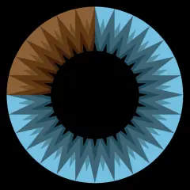 | 中国官方账号。深入浅出、直观明了地分享数学之美。资助页面：www.patreon.com/3blue1brown                                                                                                                                                                                                                       | 165w  | [Bilibili](https://space.bilibili.com/88461692?spm_id_from=333.337.0.0)                    |
| 图灵的猫           |  | 给岁月以文明，给时代以Ai。公众号/微博同名，合作邮箱deanyuton@163.com                                                                                                                                                                                                                                        | 68.8w | [Bilibili](https://space.bilibili.com/371846699?spm_id_from=333.337.search-card.all.click) |
| 跟李沐学AI         |  | 亚马逊资深首席科学家                                                                                                                                                                                                                                                                                        | 41.9w | [Bilibili](https://space.bilibili.com/1567748478?spm_id_from=333.337.0.0)                  |
| Jack-Cui           |  | 算法工程师，公众号：jackcui-ai                                                                                                                                                                                                                                                                              | 33.1w | [Bilibili](https://space.bilibili.com/331507846?spm_id_from=333.337.search-card.all.click) |
| 同济子豪兄         | 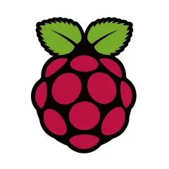 | 有温度的AI，就是爱 我是同济大学研究生张子豪，现在全职做B站UP，我每天都在创作，这个专栏就是我的一切。 所有视频均为原创，包含Python编程、人工智能、机器学习、数据挖掘、树莓派，最擅长深度学习和计算机视觉。 周更：精读AI经典论文、编程奇妙夜。 我对视频质量有强迫症般的极致追求，每一个视频都会准备很久很久。 | 18w   | [Bilibili](https://space.bilibili.com/1900783?spm_id_from=333.337.0.0)                     |
| 啥都会一点的研究生 |  | 无人驾驶感知算法工程师。帮免费推广优质课程；分享各种优质人工智能干货                                                                                                                                                                                                                                        | 16.1w | [Bilibili](https://space.bilibili.com/46880349?spm_id_from=333.337.search-card.all.click)  |
| shuhuai008         |  | wechat:hugo_zhou进群 【机器学习】【白板推导系列】                                                                                                                                                                                                                                                           | 12.7w | [Bilibili](https://space.bilibili.com/97068901)                                            |
| 王木头学科学       |  | 学习永在进行时，累了那就歇一歇                                                                                                                                                                                                                                                                              | 12.6w | [Bilibili](https://space.bilibili.com/504715181?spm_id_from=333.337.0.0)                   |
| 致敬大神           |  | 学习运动两手抓 千万别看我的收藏夹                                                                                                                                                                                                                                                                           | 8.2w  | [Bilibili](https://space.bilibili.com/389455044?spm_id_from=333.337.search-card.all.click) |
| AI算法工程师Future |  | 大家好，我是Future，一名工作多年的AI算法工程师，行走在发布人工智能优质学习资源与干货教程道路上的男人！                                                                                                                                                                                                      | 8.1w  | [Bilibili](https://space.bilibili.com/1190294984)                                          |
| KnowingAI知智      |  | 对！我很短！只有一分钟！！！                                                                                                                                                                                                                                                                                | 6.5w  | [Bilibili](https://space.bilibili.com/237111975?spm_id_from=333.337.search-card.all.click) |
| 跟着唐宇迪学AI     |  | 大家好，我是唐宇迪，平时会在线分享人工智能面试技巧，职业规划喜欢的朋友记得关注哦                                                                                                                                                                                                                            | 1.3w  | [Bilibili](https://space.bilibili.com/1435774569)                                          |

## 数学基础

| 标题                                     | 封面                                                    | 描述                          | 时长     | 视频链接                                                                                                                            |
|------------------------------------------|---------------------------------------------------------|-------------------------------|----------|-------------------------------------------------------------------------------------------------------------------------------------|
| 北大 高等代数                            | 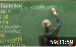 | 151节，104w播放               | 59:31:59 | [Bilibili](https://www.bilibili.com/video/BV19W411G7QU/?spm_id_from=333.999.0.0&vd_source=6435f8b5c9d53bb5395cc56fde3b7bc0)                   |
| 【完整版-麻省理工-线性代数】全34讲       | 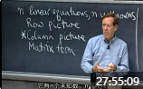 | 35小节，180.3w播放 国外老教授 | 27:55:09 | [Bilibili](https://www.bilibili.com/video/BV1ix411f7Yp/?vd_source=6435f8b5c9d53bb5395cc56fde3b7bc0)                                           |
| 《概率论与数理统计》教学视频全集（宋浩） |  | 131小节，2757w播放            | 65:24:09 | [Bilibili](https://www.bilibili.com/video/BV1ot411y7mU/?spm_id_from=333.337.search-card.all.click&vd_source=6435f8b5c9d53bb5395cc56fde3b7bc0) |

## 计算机基础

| 标题                               | 封面                                                    | 描述              | 时长     | 视频链接                                                                                                          |
|------------------------------------|---------------------------------------------------------|-------------------|----------|-------------------------------------------------------------------------------------------------------------------|
| 【计算机科学速成课】[40集全/精校]  | 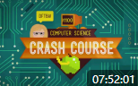 | 40小节，269w播放  | 7:52:01  | [Bilibili](https://www.bilibili.com/video/BV1EW411u7th/?vd_source=6435f8b5c9d53bb5395cc56fde3b7bc0)                         |
| 计算机网络微课堂                   |  | 73小节，219w播放  | 15:46:52 | [Bilibili](https://www.bilibili.com/video/BV1c4411d7jb/?spm_id_from=333.999.0.0&vd_source=6435f8b5c9d53bb5395cc56fde3b7bc0) |
| 清华 操作系统原理                  |  | 115节，58w播放    | 23:17:08 | [Bilibili](https://www.bilibili.com/video/BV1uW411f72n/?vd_source=6435f8b5c9d53bb5395cc56fde3b7bc0)                         |

## 编程基础

| 标题                                                              | 封面                                                    | 描述                                             | 时长     | 视频链接                                                                                                          |
|-------------------------------------------------------------------|---------------------------------------------------------|--------------------------------------------------|----------|-------------------------------------------------------------------------------------------------------------------|
| 【Python教程】《零基础入门学习Python》最新版（2022年12月2日更新） |  | 80小节，619.7w播放 最新版，还在更新 讲课幽默风趣 | 26:53:39 | [Bilibili](https://www.bilibili.com/video/BV1c4411e77t/?spm_id_from=333.999.0.0&vd_source=6435f8b5c9d53bb5395cc56fde3b7bc0) |

## 机器学习

| 标题                                              | 封面                                                    | 描述                                                                                                                                                                                 | 时长     | 视频链接                                                                                                                                |
|---------------------------------------------------|---------------------------------------------------------|--------------------------------------------------------------------------------------------------------------------------------------------------------------------------------------|----------|-----------------------------------------------------------------------------------------------------------------------------------------|
| 小白也能听懂的人工智能原理                        |  | 14课时，387w播放，B站课堂76元                                                                                                                                                        |          | [Bilibili](https://www.bilibili.com/cheese/play/ep6174?csource=common_findlecture_lecturecard_null&spm_id_from=333.874.selfDef.category_big_card) |
| 【吴恩达亲授】适用于所有人的人工智能课程（中字）  |  | 35小节，13w播放                                                                                                                                                                      | 4:21:20  | [Bilibili](https://www.bilibili.com/video/BV1gE411M7Eg/?spm_id_from=333.999.0.0&vd_source=6435f8b5c9d53bb5395cc56fde3b7bc0)                       |
| [中英字幕]吴恩达机器学习系列课程                  |  | 112小节，411w播放                                                                                                                                                                    | 19:24:24 | [Bilibili](https://www.bilibili.com/video/BV164411b7dx/?vd_source=6435f8b5c9d53bb5395cc56fde3b7bc0)                                               |
| (强推\|双字)2022吴恩达机器学习Deeplearning.ai课程 |  | 142小节，40.3w播放 这是吴恩达佬团队在Coursera新开设的机器学习课程                                                                                                                    | 19:37:02 | [Bilibili](https://www.bilibili.com/video/BV1Pa411X76s/?spm_id_from=333.999.0.0&vd_source=6435f8b5c9d53bb5395cc56fde3b7bc0)                       |
| 浙江大学-机器学习                                 | 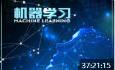 | 113小节，65.8w播放                                                                                                                                                                   | 37:21:15 | [Bilibili](https://www.bilibili.com/video/BV1qf4y1x7kB/?vd_source=6435f8b5c9d53bb5395cc56fde3b7bc0)                                               |
| 机器学习入门到精通！                              | 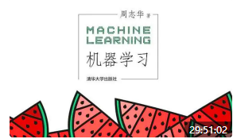 | 195小节，142w播放 唐宇迪的课                                                                                                                                                         | 29:51:02 | [Bilibili](https://www.bilibili.com/video/BV1PN4y1V7d9/?spm_id_from=333.999.0.0&vd_source=6435f8b5c9d53bb5395cc56fde3b7bc0)                       |
| 【机器学习】【白板推导系列】                      | 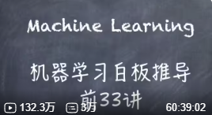 | 172小节，132w播放                                                                                                                                                                    | 60:39:02 | [Bilibili](https://www.bilibili.com/video/BV1aE411o7qd/?spm_id_from=333.337.search-card.all.click&vd_source=6435f8b5c9d53bb5395cc56fde3b7bc0)     |
| 【北交】图像处理与机器学习                        | 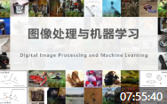 | 60小节，16.9w播放 课程包含“数字图像处理”与“机器学习”两部分。“数字图像处理”主要包括图像增强、形态学处理、图像分割等。“机器学习”部分主要包括贝叶斯决策、人工神经网络以及深度学习导论。 | 7:55:40  | [Bilibili](https://www.bilibili.com/video/BV1Kh411X7Qv/?spm_id_from=333.999.0.0&vd_source=6435f8b5c9d53bb5395cc56fde3b7bc0)                       |
| 李宏毅2021/2022春机器学习课程                     | 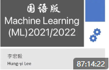 | 155小节，150.1w播放                                                                                                                                                                  | 87:14:22 | [Bilibili](https://www.bilibili.com/video/BV1Wv411h7kN/?spm_id_from=333.999.0.0&vd_source=6435f8b5c9d53bb5395cc56fde3b7bc0)                       | 

## 深度学习

| 标题                                                            | 封面                                                    | 描述                | 时长     | 视频链接                                                                                                                            |
|-----------------------------------------------------------------|---------------------------------------------------------|---------------------|----------|-------------------------------------------------------------------------------------------------------------------------------------|
| [双语字幕]吴恩达深度学习deeplearning.ai                         |  | 183小节，128.6w播放 | 27:43:37 | [Bilibili](https://www.bilibili.com/video/BV1FT4y1E74V/?vd_source=6435f8b5c9d53bb5395cc56fde3b7bc0)                                           |
| 【吴恩达团队Tensorflow2.0实践系列课程第一课】                   | 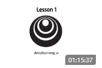 | 25小节，13.2w播放   | 1:15:37  | [Bilibili](https://www.bilibili.com/video/BV1zE411T7nb/?spm_id_from=333.999.0.0&vd_source=6435f8b5c9d53bb5395cc56fde3b7bc0)                   |
| PyTorch深度学习快速入门教程（绝对通俗易懂！）【小土堆】         |  | 33小节，204w播放    | 9:50:38  | [Bilibili](https://www.bilibili.com/video/BV1hE411t7RN/?vd_source=6435f8b5c9d53bb5395cc56fde3b7bc0)                                           |
| 这绝对是2022年全网最好【深度学习PyTorch】教程                   | 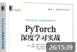 | 150小节，97w播放    | 26:15:39 | [Bilibili](https://www.bilibili.com/video/BV1YG411876u/?spm_id_from=333.999.0.0&vd_source=6435f8b5c9d53bb5395cc56fde3b7bc0)                   |
| Tensorflow2.0入门与实战 最通俗易懂的入门课程 极简TensorFlow入门 |  | 21小节，65w播放     | 3:46:25  | [Bilibili](https://www.bilibili.com/video/BV1Zt411T7zE/?vd_source=6435f8b5c9d53bb5395cc56fde3b7bc0)                                           |
| 【北京大学】Tensorflow2.0                                       | 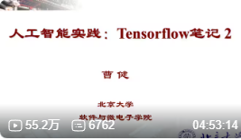 | 55小节，55w播放     | 4:53:14  | [Bilibili](https://www.bilibili.com/video/BV1B7411L7Qt/?spm_id_from=333.337.search-card.all.click&vd_source=6435f8b5c9d53bb5395cc56fde3b7bc0) |
| TensorFlow官方入门实操课程                                      |  | 126小节，14.7w播放  | 15:19:22 | [Bilibili](https://www.bilibili.com/video/BV1rz4y117p1/?spm_id_from=333.999.0.0&vd_source=6435f8b5c9d53bb5395cc56fde3b7bc0)                   |
| 深度学习超全实战项目合集                                        |  | 31小节，6.4w播放    | 20:32:03 | [Bilibili](https://www.bilibili.com/video/BV1ut4y1S7gP/?spm_id_from=333.999.0.0&vd_source=6435f8b5c9d53bb5395cc56fde3b7bc0)                   |
| 适用于初学者的Pytorch神经网络编程教学                           |  | 43小节，3.4w播放    | 10:07:24 | [Bilibili](https://www.bilibili.com/video/BV15K411N7CF/?spm_id_from=333.999.0.0&vd_source=6435f8b5c9d53bb5395cc56fde3b7bc0)                   |

## 选型

| 标题                                                                                       | 封面                                                    | 描述                         | 时长     | 视频链接                                                                                                                            |
|--------------------------------------------------------------------------------------------|---------------------------------------------------------|------------------------------|----------|-------------------------------------------------------------------------------------------------------------------------------------|
| 自然语言处理入门到精通！                                                                   |  | 149小节，98w播放 唐宇迪的课  | 25:54:20 | [Bilibili](https://www.bilibili.com/video/BV1Qd4y1y7XE/?spm_id_from=333.337.search-card.all.click&vd_source=6435f8b5c9d53bb5395cc56fde3b7bc0) |
| 计算机视觉入门到精通！公认讲的最好的【OpenCV计算机视觉教程】同济大佬12小时带你从入门到精通 |  | 96小节，275w播放 唐宇迪的课  | 12:39:40 | [Bilibili](https://www.bilibili.com/video/BV1EG4y1B7Wz/?spm_id_from=333.337.search-card.all.click&vd_source=6435f8b5c9d53bb5395cc56fde3b7bc0) |
| 全网最良心的【数据分析自学课程】它来了！                                                   |  | 16小节，150w播放             | 24:15:24 | [Bilibili](https://www.bilibili.com/video/BV1ZM4y1u7uF/?vd_source=6435f8b5c9d53bb5395cc56fde3b7bc0)                                           |
| 【公开课】最新斯坦福李飞飞cs231n计算机视觉课程【附中文字幕】                               |  | 33小节，61w播放              | 19:57:27 | [Bilibili](https://www.bilibili.com/video/BV1nJ411z7fe/?spm_id_from=333.337.search-card.all.click&vd_source=6435f8b5c9d53bb5395cc56fde3b7bc0) |
| (强推)最新斯坦福CS231n计算机视觉课程                                                       |  | 38小节，2w播放               | 45:11:20 | [Bilibili](https://www.bilibili.com/video/BV1hi4y1t7kF/?spm_id_from=333.999.0.0&vd_source=6435f8b5c9d53bb5395cc56fde3b7bc0)                   |
| 基于python3的Opencv图像处理教程(从零到实践)                                                | 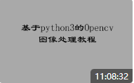 | 30小节，12w播放              | 11:08:32 | [Bilibili](https://www.bilibili.com/video/BV1CJ411D7Yj/?spm_id_from=333.999.0.0&vd_source=6435f8b5c9d53bb5395cc56fde3b7bc0)                   |
| OpenCV超实用实战项目                                                                       |  | 53小节，16.9w播放 国外搬运   | 37:40:30 | [Bilibili](https://www.bilibili.com/video/BV18B4y1c7r4/?spm_id_from=333.999.0.0&vd_source=6435f8b5c9d53bb5395cc56fde3b7bc0)                   |
| 零基础OpenCV4-C++极简入门                                                                  |  | 2.4w播放                     | 8:54:02  | [Bilibili](https://www.bilibili.com/video/BV1YY41177NU/?spm_id_from=333.999.0.0&vd_source=6435f8b5c9d53bb5395cc56fde3b7bc0)                   |
| 无人驾驶系列知识入门到提高                                                                 |  | 12小节，13.1w播放            | 26:50:06 | [Bilibili](https://www.bilibili.com/video/BV137411E7oC/?spm_id_from=333.999.0.0&vd_source=6435f8b5c9d53bb5395cc56fde3b7bc0)                   |
