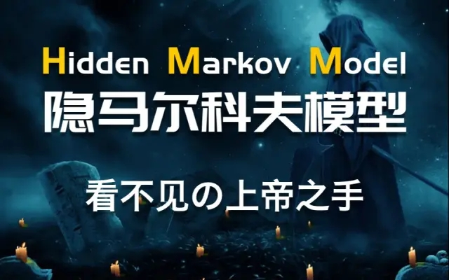

# 梗直哥自有内容精选

## 视频精选

### 数理基础

| 标题                                             | 封面                                                    | 描述                                             | 时长  | 视频                                                                                                     |
|--------------------------------------------------|---------------------------------------------------------|--------------------------------------------------|-------|----------------------------------------------------------------------------------------------------------|
| 【贝叶斯公式】主观推理与客观世界间交互的完美法则 |  | 【贝叶斯公式】主观推理与客观世界间交互的完美法则 | 04:33 | <https://www.bilibili.com/video/BV1AA4y1Z7ok/?spm_id_from=333.999.0.0>                                   |
| 最大似然MLE和最大后验MAP                         |  | 从神学角度理解【最大似然MLE】和【最大后验MAP】   | 06:05 | 为方便转换，尽量就用URL文字链就可以 https://www.bilibili.com/video/BV1vP4y1X7v3/?spm_id_from=333.999.0.0 |

### 机器学习

| 标题                                           | 封面                                                    | 描述                                                                       | 时长  | 视频                                                                   |
|------------------------------------------------|---------------------------------------------------------|----------------------------------------------------------------------------|-------|------------------------------------------------------------------------|
| 一张图搞懂机器学习是什么？                     |  | 机器学习因何而生，人类学习和机器学习的异同以及机器学习的实际应用和适用条件 | 14:34 | <https://www.bilibili.com/video/BV1de4y1E7pM>                          |
| 【线性回归、代价函数、损失函数】动画讲解       |  | 用最通俗的例子，透彻地讲清机器学习本质是咋回事儿                           | 08:45 | <https://www.bilibili.com/video/BV1RL411T7mT/?spm_id_from=333.999.0.0> |
| 【梯度下降】3D可视化讲解通俗易懂               |  | 一个实例故事，可视化讲解，揭开梯度下降的神秘面纱～                         | 12:09 | <https://www.bilibili.com/video/BV18P4y1j7uH/?spm_id_from=333.999.0.0> |
| 【SVM支持向量机】低维空间的混乱 高维空间的秩序 |  | 【SVM支持向量机】低维空间的混乱 高维空间的秩序                             | 04:20 | <https://www.bilibili.com/video/BV1Ui4y1m7T9/?spm_id_from=333.999.0.0> |
| 【HMM隐马尔科夫模型】上帝之手背后的逻辑        |  | 【HMM隐马尔科夫模型】上帝之手背后的逻辑                                    | 05:42 | <https://www.bilibili.com/video/BV14R4y1N7iH/?spm_id_from=333.999.0.0> |

### 深度学习

| 标题                                                         | 封面                                                    | 描述                                                                                                                | 时长  | 视频                                                                   |
|--------------------------------------------------------------|---------------------------------------------------------|---------------------------------------------------------------------------------------------------------------------|-------|------------------------------------------------------------------------|
| 【神经网络】大白话直观理解！                                 |  | 不让你看透神经网络本质中的本质誓不罢休…                                                                             | 06:46 | <https://www.bilibili.com/video/BV1YY411a7F7/?spm_id_from=333.999.0.0> |
| 【反向传播算法】一切都是最好的安排… backpropagation ！       |  | 从非线性动力学角度揭示神经网络与混沌理论的关联，加深你对反向传播理论的理解。                                        | 04:14 | <https://www.bilibili.com/video/BV1vA4y1o7ax/?spm_id_from=333.999.0.0> |
| 【卷积】直观形象的实例，10分钟彻底搞懂                       |  | 用最形象的比喻彻底理解卷积的本质，人工智能、机器学习、信号与系统等一众学科的必备                                    | 10:15 | <https://www.bilibili.com/video/BV1Di4y1o7vX/?spm_id_from=333.999.0.0> |
| 【卷积神经网络】8分钟搞懂CNN，动画讲解喜闻乐见               |  | 【卷积】和【神经网络】是怎么搞到一起的？                                                                            | 13:22 | <https://www.bilibili.com/video/BV1fY411H7g8/?spm_id_from=333.999.0.0> |
| 【循环神经网络】5分钟搞懂RNN，3D动画深入浅出                 |  | 20世纪影响力最大的人工智能算法，语音识别、机器翻译、自动写作、NLP等应用的核心， 通俗易懂的讲明白！                  | 06:56 | <https://www.bilibili.com/video/BV1z5411f7Bm/?spm_id_from=333.999.0.0> |
| 【LSTM长短期记忆网络】3D模型一目了然，带你领略算法背后的逻辑 |  | 看好莱坞大片轻松搞懂长短期记忆网络（LSTM，Long Short-Term Memory），20世纪最具影响力的AI算法                        | 05:23 | <https://www.bilibili.com/video/BV1Z34y1k7mc/?spm_id_from=333.999.0.0> |
| 【Transformer模型】曼妙动画轻松学，形象比喻贼好记            |  | 【Transformer模型】NLP王者，动画讲解简单到爆                                                                        | 07:38 | <https://www.bilibili.com/video/BV1MY41137AK/?spm_id_from=333.999.0.0> |
| 【Attention 注意力机制】激情告白transformer、Bert、GNN的精髓 |  | 从Attention机制到self attention，用感性的方式让你透彻理解。                                                         | 06:31 | <https://www.bilibili.com/video/BV1xS4y1k7tn/?spm_id_from=333.999.0.0> |
| 【ViT模型】嚣张的Transformer如何“浪”！                       |  | 【Vision Transformer】与CNN相比，ViT赢在哪？                                                                        | 03:43 | <https://www.bilibili.com/video/BV13B4y1x7jQ/?spm_id_from=333.999.0.0> |
| 【BERT模型】暴力的美学，协作的力量                           |  | 【BERT模型】可视化透彻解读，带你认识BERT模型成功的秘密                                                              | 05:15 | <https://www.bilibili.com/video/BV1NS4y1e7gz/?spm_id_from=333.999.0.0> |
| 【GNN 图神经网络】直观透彻理解                               |  | 借史上最经典的科幻片让你一下子领悟图神经网络（GNN，Graph Neural Network）的精髓，彻底搞懂这两年最火的一大类AI模型。 | 04:38 | <https://www.bilibili.com/video/BV1nu411e7yb/?spm_id_from=333.999.0.0> |
| 【GAN生成对抗网络】两种文明的对抗，世界秩序的重建            |  | 文明的进化源自博弈，GAN模型异曲同工。看似无监督学习，其实是互监督与自学习。                                         | 04:15 | <https://www.bilibili.com/video/BV1kT4y1B787/?spm_id_from=333.999.0.0> |
| 【变分自编码器VAE】可视化讲明白                              |  | 深入浅出介绍模型结构、核心思想和各类应用…                                                                           | 04:13 | <https://www.bilibili.com/video/BV1f34y1e7EK/?spm_id_from=333.999.0.0> |

### 论文精讲

| 标题                                                    | 封面                                                    | 描述                                                                                                                                                                                                                  | 时长  | 视频                                                                   |
|---------------------------------------------------------|---------------------------------------------------------|-----------------------------------------------------------------------------------------------------------------------------------------------------------------------------------------------------------------------|-------|------------------------------------------------------------------------|
| 如何快速搞懂【AI论文】？朴实无华 全是技巧               |  | 读论文几乎是每个AI人的必修课，原汁原味的paper，不仅是紧跟科技前沿的最好来源，更是去伪存真的第一手资料。然而学术英文往往晦涩难懂，艰深的理论、众多的细节，成为很多人心中的痛。如何去粗取精，去伪存真，秘诀就在这里了。 | 05:38 | <https://www.bilibili.com/video/BV16V4y1p73b/?spm_id_from=333.999.0.0> |
| 【论文必读：EM算法】搞数据分析不懂这个怎么混？          |  | 数据挖掘十大算法之首！纷繁复杂的数据丛林中，坚信隐变量的存在，依据概率统计原则不懈努力逐渐逼近…                                                                                                                       | 38:56 | <https://www.bilibili.com/video/BV1qG4y1i7Hs/?spm_id_from=333.999.0.0> |
| 【反向传播 论文精读】在错误中学习，在传递中演进         |  | 温故而知新，在经典论文中去伪存真，发现不一样的认知！短小精悍的论文，每一段都值得细细品味！                                                                                                                            | 33:54 | <https://www.bilibili.com/video/BV1954y1o7bh/?spm_id_from=333.999.0.0> |
| 【ADAM算法 论文精读】史上最火梯度下降算法是如何炼成的？ |  | 【ADAM算法 论文精读】史上最火梯度下降算法是如何炼成的？                                                                                                                                                               | 31.37 | <https://www.bilibili.com/video/BV1Sg41197kL/?spm_id_from=333.999.0.0> |
| 【AlexNet 论文精读】世人笑TA太疯癫， TA笑世人看不穿     |  | 【AlexNet论文精读】开山之作！深度卷积网络CNN详解                                                                                                                                                                      | 23:40 | <https://www.bilibili.com/video/BV1aW4y1k74S/?spm_id_from=333.999.0.0> |
| 【VGGNet】3X3卷积核如何成为CNN标配                      |  | VGG的横空出世，终结了卷积核的战国时代，天下一统到3X3麾下。虽然它并不深，但却足够小，在AI发展史上留下了属于自己的那一笔                                                                                                | 35:47 | <https://www.bilibili.com/video/BV1cT411T7uL/?spm_id_from=333.999.0.0> |
| 【论文必读：ResNet】如此多娇，引无数英雄折了腰          |  | 【ResNet 残差网络 论文精读】史上最高引用量！“打小报告”原来这么酸爽！                                                                                                                                                  | 37:19 | <https://www.bilibili.com/video/BV1XU4y1X7b5/?spm_id_from=333.999.0.0> |
| 【论文必读：Transformer】被捧上天的玩意儿，就这？！     |  | 【Transformer论文精读】把注意力玩明白                                                                                                                                                                                 | 32:11 | <https://www.bilibili.com/video/BV1BW4y1U7gm/?spm_id_from=333.999.0.0> |
| 【论文精读：BERT】新解transformer家的姑娘               |  | 不懂BERT，学啥transformer？解密BERT背后的故事                                                                                                                                                                         | 38:15 | <https://www.bilibili.com/video/BV1CT411L7HZ/?spm_id_from=333.999.0.0> |

### 编程实践

| 标题                                                    | 封面                                                    | 描述                                                                                                                                                                                            | 时长  | 视频                                                                   |
|---------------------------------------------------------|---------------------------------------------------------|-------------------------------------------------------------------------------------------------------------------------------------------------------------------------------------------------|-------|------------------------------------------------------------------------|
| 【conda实用命令】精选干货内容，必知必会3分钟搞定        |  | Anaconda是一个基于python的科学计算平台，可用于进行大规模数据处理，预测分析和科学计算。软件包管理系统conda可以方便快捷的操作。                                                                   | 04:46 | <https://www.bilibili.com/video/BV1PT4y1i7qt/?spm_id_from=333.999.0.0> |
| 【Jupyter Notebook】快速上手 轻松玩明白                 |  | Jupyter Notebook 集编程和文档与一身，是用python进行数据科学、机器学习的神器。 它能够分段运行代码块，随时编写文档说明，有多种魔法函数... 简单易上手，看完这个视频后在多加练习,你会对它爱不释手！ | 04:12 | <https://www.bilibili.com/video/BV1rr4y1n76P/?spm_id_from=333.999.0.0> |
| 【Numpy】入门机器学习必须吃掉的前菜 喂到你嘴里          |  | 【Numpy】入门机器学习必须吃掉的前菜 喂到你嘴里                                                                                                                                                  | 08:01 | <https://www.bilibili.com/video/BV1qv4y1T7kw/?spm_id_from=333.999.0.0> |
| 【matplotlib入门教程】数据分析小能手，靓图绘制小秘密    |  | 【matplotlib入门教程】Matplotlib python数据分析画图届扛把子                                                                                                                                     | 03:27 | <https://www.bilibili.com/video/BV1ga411Y7Fg/?spm_id_from=333.999.0.0> |
| 【CUDA + Anaconda 】深度学习环境配置，3分钟搞定简单粗暴 |  | 手把手教你环境配置的各种细节，几分钟速看概览                                                                                                                                                    | 05:13 | <https://www.bilibili.com/video/BV1oF411s7RS/?spm_id_from=333.999.0.0> |
| 【PyTorch】机器学习和深度学习最流行的框架 动手安装      |  | 【不一样的PyTorch】机器学习小嘿嘿们的最爱                                                                                                                                                       | 04:30 | <https://www.bilibili.com/video/BV12Y4y177Jf/?spm_id_from=333.999.0.0> |

## 文章精选

### 机器学习

| 标题                                 | 简介                                                                                                                                                                                                                                                      | 链接                                                               |
|--------------------------------------|-----------------------------------------------------------------------------------------------------------------------------------------------------------------------------------------------------------------------------------------------------------|--------------------------------------------------------------------|
| 为啥要学机器学习和为啥不学机器学习？ | 为啥要学机器学习和为啥不学两个话题                                                                                                                                                                                                                        | <https://www.bilibili.com/read/cv15661231?spm_id_from=333.999.0.0> |
| 机器学习的江湖                       | 机器学习是一种比较有效的实现人工智能的方式，也是它的核心和重要理论基础。 如今，机器学习的应用已渗透进人工智能的各个分支。我们这里并不想给这门学科进行考古，感兴趣的话网上资料很多。只是，以史为镜，有不一样的思考和发现，往往能够引导你学习求知的正确方向 | <https://www.bilibili.com/read/cv16045184?spm_id_from=333.999.0.0> |
| 希望是个不太一样的机器学习路线图     | 开启机器学习的旅程，哪个人不想少走弯路、节约时间、充分利用现成资源呢？本期就这三个问题，以过来人的视角和经验，提供一些建议，尽量让你避开一些常见的坑，更加高效愉悦地实现自己的目标                                                                        | <https://www.bilibili.com/read/cv15698413?spm_id_from=333.999.0.0> |

